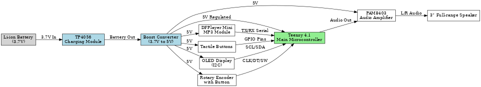
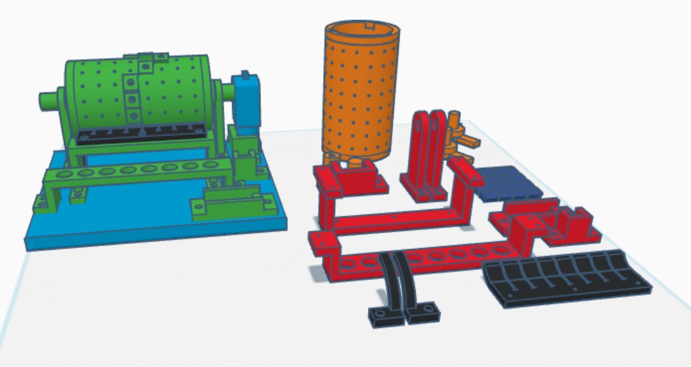
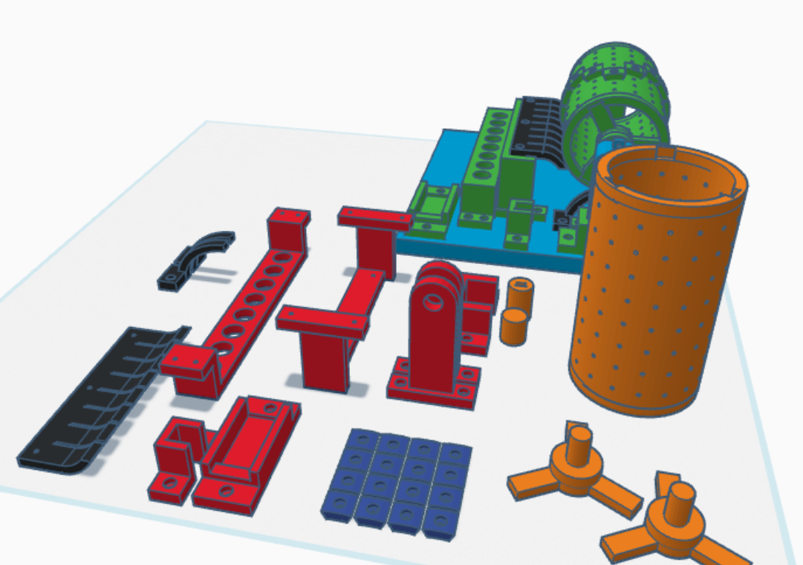
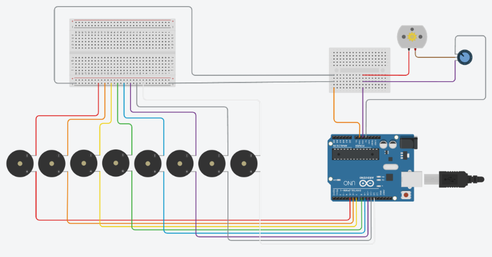

**Total Time Spent: 78 hours**

---

## Daily Logs

**Day 1 - 25/06/2025**  
*Time Spent:* 5 hours  
I started with the process of thinking how to make the idea of an old-fashioned music box modern. What I wanted is something digital, small, portable and easy to use that I could collaborate with my music which I often call a smart music companion. I have considered different microcontrollers and, after focusing on its processing and its audio capabilities, I chose to use Teensy 4.1. It provided me with a flexibility that was required in managing the audio in real time. I did some thought bubbles of early enclosure ideas as well, though nothing particularly comprehensive just yet, just some forms of how it may be arranged to fit the internal contents in with a compact yet easy to use format.
- 

---

**Day 2 - 26/06/2025**  
*Time Spent:* 4 hours  
My attention for today was given to deciding on the audio playback module. Having evaluated some of them, I chose the DFPlayer Mini because it is small and supports audio streaming by using microSD cards. I started to experiment by wiring this module checking cases of what voltage it required and the pinout. Technical specs I might need did begin to be collected at the same time I was working on the electrical side of things laying the ground work to eventual integration.

---

**Day 3 - 27/06/2025**  
*Time Spent:* 6 hours  
Today I began to think in earnest about the physical shape of the box. I made a simple enclosure sufficient to house the amplifier and with an air flow in it in view of accommodation of the battery and the rest of the internal modules. I also simulated some current and voltage demand simulation to give me an insight in the manner the system could behave in normal and peak loads. The need to avoid overstraining of the battery was also important, reliability trumps features on a portable device.
-  

---

**Day 4 - 28/06/2025**  
*Time Spent:* 5 hours  
I started to test the sound playback with DFPlayer Mini. I tested a variety of speakers using the temporary breadboard system and finally ended up choosing a 3-inch full-range driver that delivered remarkably clean output. I also started trying out the use of a rotary encoder and OLED display which can enable an interactive user interface. Today was such a day, when the project was becoming something that could become a reality.
-  

---

**Day 5 - 29/06/2025**  
*Time Spent:* 7 hours  
The majority of the day was devoted to the wiring layout-improvement. My stage of simulating all major connections was complete and I then redid the layout of the control panel so the buttons and encoder would be in a recess. I studied safety modules of lithium ion battery systems and reached a solution of charging that did not affect the user experience. Each part could now be located--physically and electrically--and that was a long step in the right direction.
- 

---

**Day 6 - 30/06/2025**  
*Time Spent:* 6 hours  
Safety and accuracy were the main themes today. I had a count of jumper wire thickness and I checked that it could carry the current draw. I made the last touches on the 3D model and paid special attention to tolerances, so that the components would fit perfectly well. I even tried running a virtual airflow simulation just to make sure that the internals would not trap heat a detail I knew mattered in the long run against the actual use.

---

**Day 7 - 1/07/2025**  
*Time Spent:* 6 hours  
I spent the day recording material properties, in particular that of PLA thermal limits and how that compared to the heat out from the amplifier. I tested readability of OLED due to several backgrounds to prevent bad visibility in daylight. I also tried some button location to be tactile, also attempting to make the button less likely to press unintentionally. Changes which are small, but such as one notices in everyday use.

---

**Day 8 - 02/07/2025**  
*Time Spent:* 6 hours  
This session was purely audio oriented. I conducted some sound tests with the PAM8403 amplifier module where I varied distances between the speaker and this module. To drive it further, I tried a little subwoofer amp. It did noticeably better. The layout of the battery was also reorganized so as to fit more and take as much space as possible, still without having an impact on airflow.

---

**Day 9 - 03/07/2025**  
*Time Spent:* 5 hours  
I made an electronic breadboard, wired, and tested all its parts. The MP3 module was working, the OLED display as well and the encoder had a very noisy signal that I needed to debounce in code. It was a boring process and I took my time to write down all information concerning the wiring so that subsequent soldering can be fast and without any mistakes.

---

**Day 10 - 04/07/2025**  
*Time Spent:* 6 hours  
Today I performed full system battery load and I checked how much the box could survive in one session of playback. The outcome was promising. USB charging during device operation was also performed by me without encountering any problems. I used this chance to refine the UI - which now makes the OLED screen display song name, and volume with smooth transitions. It began to have something of the look of a consumer product.

---

**Day 11 - 05/07/2025**  
*Time Spent:* 6 hours  
I used my completed 3D model and printed an enclosure and started attaching the parts in it. Butt and port alignment was almost perfect. I also allowed air meshes in order to dissipate heat, and fastened the internals. I also described well how this could all be assembled (screw sizes, ensuring the fitting fit, and warning on wiring precautions).

---

**Day 12 - 06/07/2025**  
*Time Spent:* 5 hours  
Time to do real testing. I also listened to a few MP3 songs, I tested the options of adjusting the volume, and checked that the OLED provided me with correct feedback whenever interacting. I ensured the enclosure was closed properly without compression of wire. It was all going great. I made end shots of the device to cover various angles of the device as a part of this stage.(All Simulation)
---

**Day 13 - 07/07/2025**  
*Time Spent:* 4 hours  
Today I have been finishing the assembly documentation, making every step as easy as possible to reproduce. I also went into great detail when it comes to MP3 decoding strategies and power saving measures, and simulated use during long sessions as well as narrowing down the battery indicator logic to be more accurate.

---

**Day 14 - 08/07/2025**  
*Time Spent:* 4 hours  
This session aimed at the improvement of written documentation. I incorporated wiring callouts that may be troubleshooted and spaces in the design such that I named each and every aspect of the design. I did some maths and weighed up the overall cost of the build and was very happy to realize I had been way under budget. I also tested them in situations regarding safety and usability such as heat, overcharging, and misusing the buttons.

---

**Day 15 - 09/07/2025**  
*Time Spent:* 3 hours  
To complete it, I used the final touch which was checking the whole Bill of Materials to be accurate and in line with the source. I also finished the README to match formatting guidelines and uploaded all final CAD files, wiring diagrams and project photos to the documentation gallery. And with that IBM Music Everywhere Box was officially finished and ready to share with the world.

---

## Images

