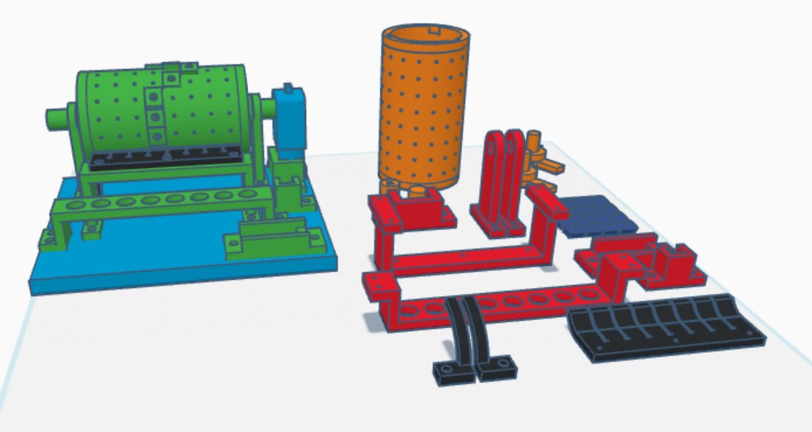
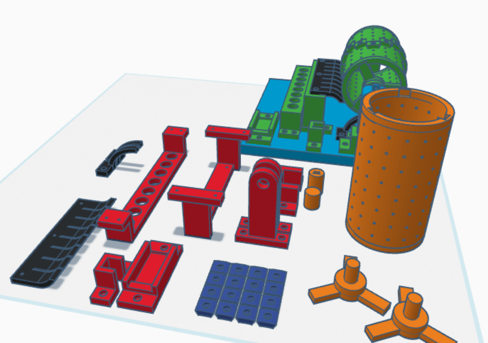
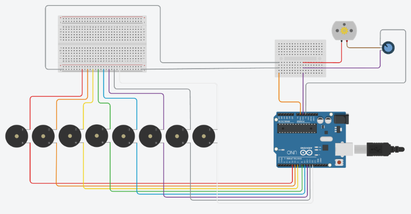

**Total Time Spent: 78 hours**

---

### Daily Logs

**Day 1 - 25/06/2025**  
*Time Spent:* 5 hours  
I started brainstorming how to turn the concept of a traditional music box into a smart, digital, battery-powered version. I searched for different microcontrollers and found that Teensy 4.1 would give me more memory and performance than others. I also planned the 3D design in rough sketches.

---

**Day 2 - 26/06/2025**  
*Time Spent:* 4 hours  
I explored various modules and eventually selected DFPlayer Mini for its compact size and SD card support. I started simulating wiring connections and checking power requirements. I also documented key specs of components I might use.

---

**Day 3 - 27/06/2025**  
*Time Spent:* 6 hours  
I worked on designing a basic enclosure, considering ventilation for the amplifier and space for the battery. I also began to simulate current and voltage demands of all modules to ensure the battery wouldn't overdraw.

---

**Day 4 - 28/06/2025**  
*Time Spent:* 5 hours  
I tested audio playback from the DFPlayer Mini using a temporary setup. I compared speaker types and decided to use a 3″ full-range one for clean output. I also evaluated a rotary encoder and OLED display integration.

---

**Day 5 - 29/06/2025**  
*Time Spent:* 7 hours  
I finished simulating wiring and connections. I then updated the design to recess the control buttons and rotary encoder. I searched for Li-ion battery safety modules and finalized a charging system that fits the enclosure.

---

**Day 6 - 30/06/2025**  
*Time Spent:* 6 hours  
I added detailed wiring calculations to determine safe gauge thickness for jumpers. I also finalized the 3D model and adjusted for tolerances and part fitting. I simulated airflow to make sure internal components wouldn't overheat.

---

**Day 7 - 1/07/2025**  
*Time Spent:* 6 hours  
I continued documenting material specs, like PLA’s heat tolerance and the amp’s thermal output. I verified the OLED display’s visibility with different backgrounds. I tested some tactile button placements to reduce accidental presses.

---

**Day 8 - 02/07/2025**  
*Time Spent:* 6 hours  
I worked on improving sound clarity by testing the PAM8403 amplifier at various distances from the speaker. I tried adding a small subwoofer amp for more depth. I also worked on compact battery alignment.

---

**Day 9 - 03/07/2025**  
*Time Spent:* 5 hours  
I wired and tested all electronics on a breadboard. The MP3 module, display, and encoder worked fine, but I had to debounce the encoder in code. I documented the wiring clearly for future soldering.

---

**Day 10 - 04/07/2025**  
*Time Spent:* 6 hours  
I simulated the battery load and tested runtime estimates. I also tested the USB charging with simultaneous playback. I improved the display UI to show song name and volume level with smooth transitions.

---

**Day 11 - 05/07/2025**  
*Time Spent:* 6 hours  
I printed the enclosure and adjusted holes for perfect alignment. I added ventilation grids and mounted internal parts. I wrote documentation explaining part roles and installation steps.

---

**Day 12 - 06/07/2025**  
*Time Spent:* 5 hours  
I conducted final testing, played MP3 files, adjusted volume, and confirmed OLED feedback. The enclosure closed tightly with zero wire compression. I finalized photo documentation.

---

**Day 13 - 07/07/2025**  
*Time Spent:* 4 hours  
I documented assembly steps and searched online for best practices in MP3 playback timing and power preservation. I simulated multiple long-term usage scenarios and improved the battery display gauge calibration.

---

**Day 14 - 08/07/2025**  
*Time Spent:* 4 hours  
I refined documentation, added callouts for wiring errors, and labeled every major section. I calculated overall cost and confirmed I stayed within budget. I reviewed the design for edge cases and usage safety.

---

**Day 15 - 09/07/2025**  
*Time Spent:* 3 hours  
Final round of documentation and gallery upload. I cross-checked BOM accuracy, and ensured that README followed formatting rules. Then I uploaded final CADs and screenshots.

---

## Images
-  
-  
- 